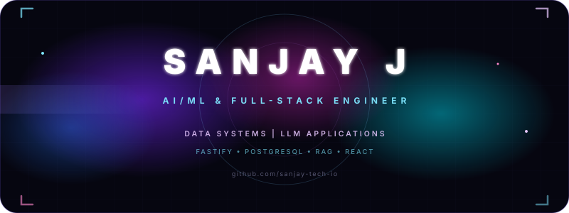
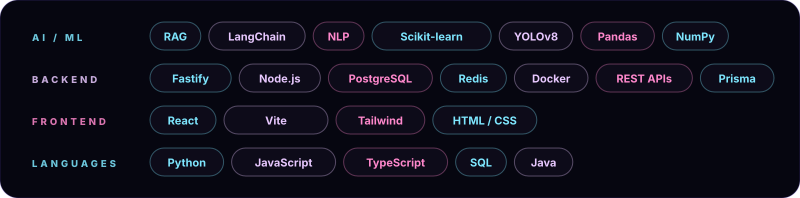
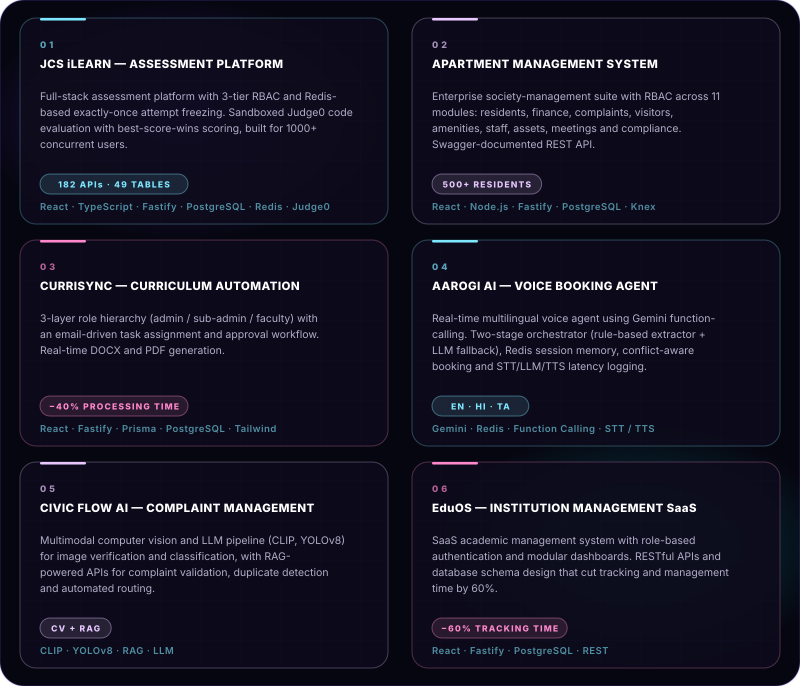

<div align="center">



<br/>

<a href="https://linkedin.com/in/sanjay-131805js"></a>
<a href="mailto:sanjayjayaseelan@gmail.com"></a>
<a href="https://github.com/sanjay-tech-io"></a>


<br/><br/>


</div>

## ⟡ ABOUT

```text
> whoami        →  Sanjay J — AI/ML & Full-Stack Engineer
> education     →  B.E Mechanical Engineering · PSG iTech · 2023–2027 · CGPA 8.21
> focus         →  Backend APIs, LLM applications, data systems
> building      →  RBAC-driven platforms, RAG pipelines, real-time voice agents
> interests     →  System Design · Operating Systems · DBMS · Machine Learning
> recognition   →  Runner, OpenAI Buildathon · 1 Patent (Agri-field multi-legged device)
```

<div align="center"></div>

## ⟡ TECH STACK

<div align="center">

</div>

<div align="center"></div>

## ⟡ PRIMARY DEPLOYMENTS

<div align="center">

</div>

<div align="center"></div>

## ⟡ EXPERIENCE LOG

```text
2026  JUN – AUG   Software Developer · JCS iLearn
                  Full-stack assessment platform (React, Fastify, PostgreSQL) — 182 REST APIs,
                  49 tables, 3-tier RBAC, Redis exactly-once attempt freezing. Built the
                  company portfolio website.

2026  MAY – JUL   Software Developer · Bluekode Solutions
                  Apartment Management System for 500+ residents with RBAC. Revamped REST APIs
                  for the Curriculum Automation System — 40% faster processing via real-time
                  document generation.

2025  SEP – OCT   AI/ML Engineer · CODEX
                  Shipped ML models into production apps at 95% accuracy on classification and
                  prediction tasks. Cleaned and prepared 1000+ record datasets.
```

<div align="center"></div>

## ⟡ GITHUB ANALYTICS

<div align="center">


</div>

<div align="center"></div>

## ⟡ ACTIVITY PULSE

<div align="center">

</div>

<br/>

<div align="center"></div>
